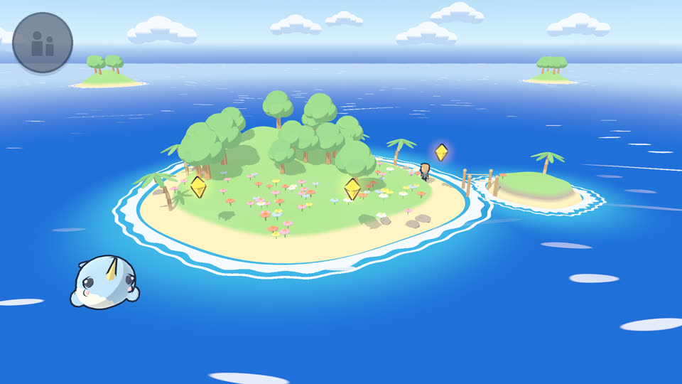
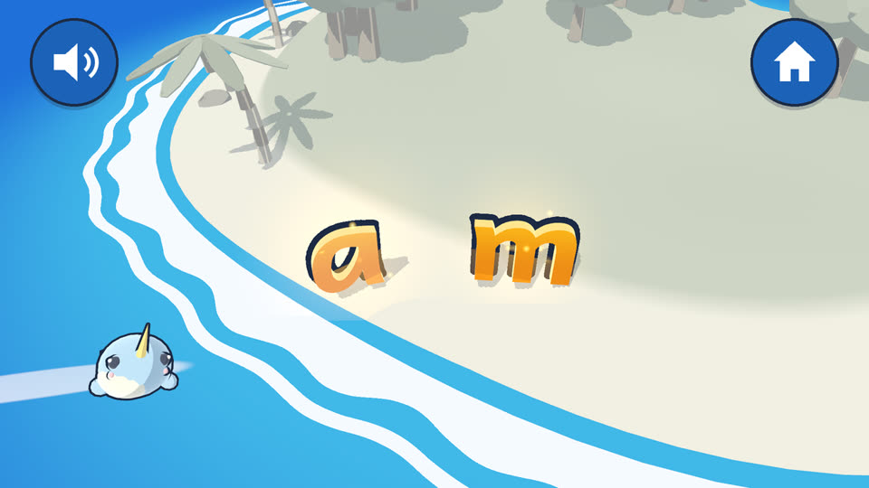
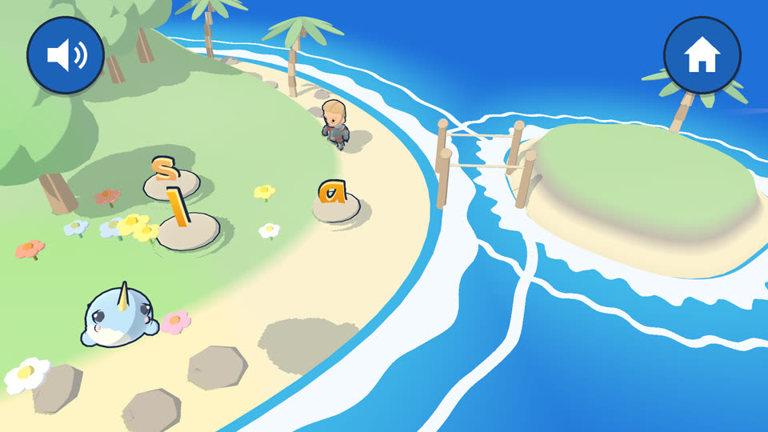
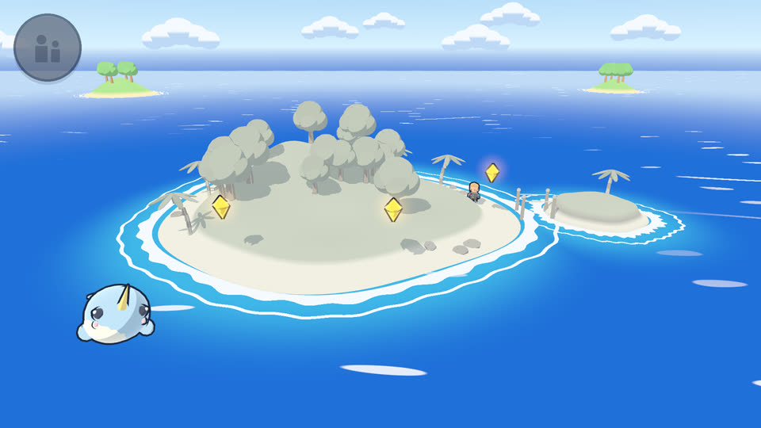

# MWM Les

A 3D reading adventure for Norwegian children aged 4 to 7. The child sails to a grey
island with Pip, a small narwhal, learns the sounds of the letters, and brings colour
and life back to the island one sound at a time. Every instruction is spoken in
Norwegian (bokmål), so a child who cannot read yet can play alone.
**No ads, no in-app purchases, no timers, no tracking, no internet permission.**

The teaching is built on reading research, with the sources checked one by one in
[docs/RESEARCH.md](docs/RESEARCH.md): letter sounds in a fixed order, sounds held and
blended together (/sssooolll/ → *sol*), letters written from memory instead of traced,
and a grown-up who listens to the child read at the end of every session.

  
  

  
  

## Download

**Direct APK download:**
https://github.com/Matswm86/mwm-les/releases/download/latest/mwm-les.apk

1. Open that link in your phone's or tablet's browser and tap to download.
2. When you open the file, Android may ask you to allow installs from this source.
   Tap **Settings**, turn on **Allow from this source**, go back and install.
3. The app appears as **MWM Les**. It plays in landscape.

The APK is debug-signed with a stable key, so a newer build installs over an older one
and keeps the child's progress. Builds made before 3 October 2026 at 21:30 used a
one-off key: uninstall that version once before installing a newer one.

## How to play

The child taps one of the glowing stations on the island. Each station is a short
activity, and finishing it brings that part of the island back to colour.

| Activity | What the child does | Based on |
|---|---|---|
| Hør og finn (listen and find) | Pip says a sound; the child taps the gold letter that makes it. A wrong letter says its own sound and wobbles. | Systematic letter-sound teaching |
| Sandskriving (sand writing) | Pip writes the letter stroke by stroke and says its sound, then the child writes it from memory in the sand. | Handwriting from memory, not tracing |
| Ordbroa (the word bridge) | The child drags letter stones onto a bridge to build a word; the hero walks across and the word is read aloud. | Moveable alphabet, connected blending |

After about 12 minutes Pip gets sleepy. The child reads the day's words to a grown-up,
who holds the **Voksen: Hørt!** button, and Pip suggests one thing to do away from the
screen. Wrong answers never end anything: the material shows the mistake and the child
tries again. Hints grow step by step and fade as the child gets better.

**Parent area:** hold the button in the top-left corner for 3 seconds and solve a
sum. It shows how far the child has come with each sound, plus tips for reading
together.

## Status

Early test build: the first island with the first six sounds (a, s, i, l, o, m).
The design for the full game, six worlds from listening games to reading a whole
story, is in [docs/GDD.md](docs/GDD.md).

## How it works

- `scripts/learn_core/` is a learning engine with no reading knowledge in it. It keeps
  a mastery estimate per skill, picks tasks the child gets right about 70-85% of the
  time, and runs the hint ladder. A content pack drives it; the reading pack is
  `content/nb_reading/` (`skills.json` holds the sound order, `items.json` the tasks),
  so a maths pack can reuse the same engine.
- The cel-shaded look comes from a toon light shader (`shaders/toon.gdshader`) with a
  two-tone shadow, an outline shell on things the child can touch, and unshaded gold
  letters with a halo.
- Every spoken line is a sound file generated once from `tools/voice_lines.tsv` by
  `tools/make_voice.py`, so the app never needs the internet. Single letter sounds are
  cut from a spoken sentence, because a voice reading "sss" on its own spells the letter.

## Credits

- Voice: Microsoft Finn (nb-NO), generated with [edge-tts](https://github.com/rany2/edge-tts).
- Hero: [KayKit Adventurers](https://github.com/KayKit-Game-Assets/KayKit-Character-Pack-Adventures-1.0)
  by Kay Lousberg (CC0). Full asset list and licences: [docs/ASSETS.md](docs/ASSETS.md).
- Font: [Andika](https://software.sil.org/andika/) by SIL, designed for beginning
  readers (SIL Open Font License, see `assets/fonts/OFL.txt`).

## Run from source

1. Install **Godot 4.6.x** from https://godotengine.org/.
2. Import `project.godot` and press **F5**. The mouse works as a finger.

The engine tests run headless from `tests/`. `tests/capture.tscn` is a dev-only scene
(not exported) where a bot plays the whole island and saves screenshots; run it under
Xvfb with `CAPTURE_DIR=/some/dir` and `--audio-driver Dummy`.

## Build

GitHub Actions builds the APK on every push to `main`
(`.github/workflows/build-android.yml`) and publishes it to the rolling `latest`
release.

## License

Code: MIT (see `LICENSE`). Third-party assets keep their own licences, listed in
[docs/ASSETS.md](docs/ASSETS.md).
